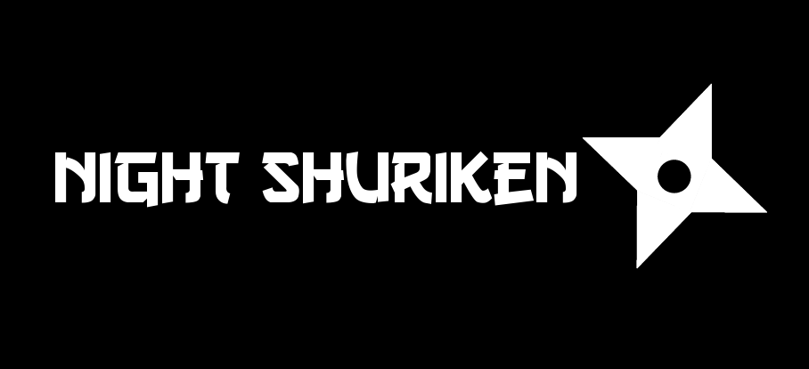
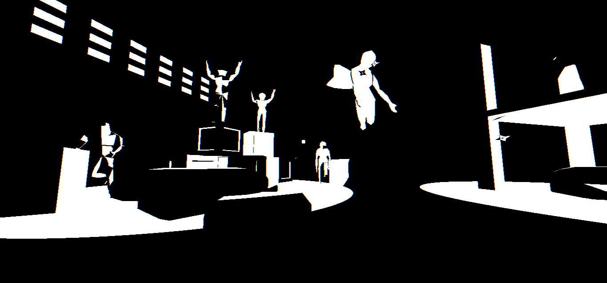

# night-shuriken
### [itch.io page and free download](https://kiwijuice56.itch.io/night-shuriken)

A stylized arcade shooter developed for the Texas 2022 Game Jam with the theme Negative Space. The game and most assets were developed in 48 hours. The game ultimately received the "People's Choice Award" and the "Best Game of Show Award". This repository hosts the online playable build of the game.

## Attribution
- Dart sound modified from tonnonic on freesound.org
- Flesh sound modified from magnuswaker on freesound.org
- First person camera code from Godot Asset Library
- Screen shake code from kidscancode.org
